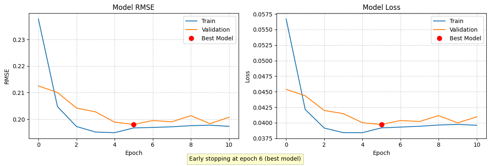

# Proyek Kedua Movie Recommendation System

Disusun oleh: **Junianto Endra Kartika**

Proyek *Machine Learning Terapan* ini akan membangun sistem rekomendasi movie bagi pengguna.

## Project Overview

  

Gambar 1. Cover

Proyek ini mengembangkan sebuah sistem rekomendasi film yang canggih dengan memanfaatkan kekuatan algoritma pembelajaran mesin untuk memahami dan memprediksi preferensi pengguna. Sistem ini mengintegrasikan dua pendekatan utama: *Collaborative Filtering*, yang mengidentifikasi pengguna dengan selera serupa untuk merekomendasikan film berdasarkan penilaian kolektif, dan *Content-Based Filtering*, yang menganalisis karakteristik intrinsik film seperti genre, sutradara, dan aktor untuk menyarankan konten yang relevan. Melalui kombinasi sinergis kedua teknik ini, proyek ini bertujuan untuk menyajikan rekomendasi film yang sangat dipersonalisasi dan akurat, sehingga secara signifikan meningkatkan pengalaman pengguna, mendorong kepuasan, serta memperkuat loyalitas pelanggan seperti yang didukung oleh penelitian [1][2].

## Business Understanding

Bagian ini bertujuan untuk mengklarifikasi masalah yang mendasari pengembangan sistem rekomendasi film ini. Melalui pemahaman yang mendalam terhadap tantangan yang ada, kita dapat merumuskan tujuan yang jelas dan solusi yang terukur.

### Problem Statement

- Bagaimana cara mengatasi kelebihan informasi dan mempermudah pengguna menemukan film yang relevan di antara banyaknya pilihan yang tersedia?
- Mengapa rekomendasi film yang bersifat generik kurang memuaskan preferensi individual pengguna?
- Bagaimana platform penyedia film dapat memanfaatkan sistem rekomendasi yang lebih baik untuk meningkatkan engagement dan retensi penggunanya?

### Goals

- Meningkatkan Kemudahan Penemuan Film yang Relevan
- Meningkatkan Tingkat Personalisasi Rekomendasi Film
- Memaksimalkan Engagement dan Retensi Pengguna Melalui Rekomendasi yang Efektif

### Solution Statements

- Melakukan Eksplorasi dan Visualisasi Data Awal
- Implementasi Pendekatan *Content-Based Filtering*
- Implementasi Pendekatan *Collaborative Filtering*

## Data Understanding

Dataset yang digunakan dalam proyek ini adalah **MovieLens 100k Dataset** yang bersumber dari [GroupLens](https://grouplens.org/datasets/movielens/100k/).

### Deskripsi Dataset

Karena dataset memiliki format yang berbeda-beda, penelitian ini memerlukan `Data Loading` untuk menyiapkan data untuk menjadi data yang siap untuk dikembangkan. Berikut adalah data yang akan digunakan pada penelitian ini:

- User (Jumlah pengguna: 943)
  - `user_id`: ID pengguna
  - `age`: umur pengguna
  - `sex`: jenis kelamin pengguna
  - `occupation`: pekerjaan pengguna
  - `zip_code`: kode alamat pengguna

- Genre (Jumlah genre: 19)
  - `genre_name`: nama genre
  - `genre_id`: ID genre

- Movie (Jumlah film: 1682)
  - `movie_id`: ID film
  - `movie_title`: judul film
  - `release_date`: tanggal terbit film
  - `video_release_date`: tanggal video film terbit
  - `IMDb_URL`: URL IMDb film
  - Sisa dari kolom `movie` adalah *One-hot encoded* genre

- Rating (Jumlah rating: 100000 / 100k)
  - `user_id`: ID user
  - `movie_id`: ID film
  - `rating`: rating yang diberikan user terhadap film
  - `unix_timestamps`: tanggal rating diberikan oleh user dalam bentuk *unix*

### Exploratory Data Analysis (EDA)

*Exploratory Data Analysis* (EDA) merupakan tahap awal analisis data untuk mengenali sifat-sifat utama, susunan, dan elemen penting dalam dataset sebelum analisis statistik atau prediksi yang lebih mendalam.

Berikut adalah tahapan EDA yang telah dilakukan:

#### Users

Eksplorasi data pada users akan memperlihatkan distribusi pemberian rating tiap user

  

Gambar 2. Distribusi rating tiap user

Dengan rata-rata jumlah penilaian tiap user adalah `106` rating, dengan pemberian jumlah rating terbanyak pada user adalah `737` dan pemberian jumlah rating terendah pada user adalah `20`.

#### Genres

  

Gambar 3. Jumlah film tiap genre

Total genre adalah 19 genre dengan jumlah film terbanyak terdapat pada genre **Drama** sedangkan jumlah film terendah terdapat pada genre **Unknown**.

#### Ratings

  

Gambar 4. Distribusi nilai rating

Gambar 4 menunjukkan bahwa nilai rating terbanyak terdapat pada rating `4` dengan rata-rata rating adalah `3.53`.

## Data Preprocessing && Data Preparation

### Data Preprocessing

#### Pembersihan Genre yang Tidak Diketahui

Karena genre **Unknown** hanya memiliki total 2 film, maka genre **Unknown** akan dihapus untuk menjaga keseimbangan data.

#### Pengolahan Data untuk Content Based Filtering

Pada pendekatan *Content-Based Filtering*, data diolah melalui beberapa tahap penting untuk memungkinkan sistem merekomendasikan film berdasarkan karakteristik intrinsiknya:

1. **Ekstraksi Fitur Genre**: Data film yang berisi encoding one-hot untuk 18 genre digunakan sebagai basis utama. Setiap film memiliki representasi biner (0 atau 1) untuk setiap genre yang menandakan apakah film tersebut termasuk dalam kategori genre tersebut.

2. **Konversi Data Genre ke Format Teks**: Untuk memudahkan pemrosesan, data genre yang awalnya berbentuk encoding one-hot diubah menjadi string teks yang berisi daftar genre yang dimiliki setiap film, seperti "Comedy Drama Romance".

|   | movie_id |       movie_title | Action | Adventure | Animation | Children's | Comedy | Crime | Documentary | Drama | ... | Horror | Musical | Mystery | Romance | Sci-Fi | Thriller | War | Western | release_year |                      genres |
|--:|---------:|------------------:|-------:|----------:|----------:|-----------:|-------:|------:|------------:|------:|----:|-------:|--------:|--------:|--------:|-------:|---------:|----:|--------:|-------------:|----------------------------:|
| 0 |        1 |  Toy Story (1995) |      0 |         0 |         1 |          1 |      1 |     0 |           0 |     0 | ... |      0 |       0 |       0 |       0 |      0 |        0 |   0 |       0 |         1995 | Animation Children's Comedy |
| 1 |        2 |  GoldenEye (1995) |      1 |         1 |         0 |          0 |      0 |     0 |           0 |     0 | ... |      0 |       0 |       0 |       0 |      0 |        1 |   0 |       0 |         1995 |   Action Adventure Thriller |
| 2 |        3 | Four Rooms (1995) |      0 |         0 |         0 |          0 |      0 |     0 |           0 |     0 | ... |      0 |       0 |       0 |       0 |      0 |        1 |   0 |       0 |         1995 |                    Thriller |
| 3 |        4 | Get Shorty (1995) |      1 |         0 |         0 |          0 |      1 |     0 |           0 |     1 | ... |      0 |       0 |       0 |       0 |      0 |        0 |   0 |       0 |         1995 |         Action Comedy Drama |
| 4 |        5 |    Copycat (1995) |      0 |         0 |         0 |          0 |      0 |     1 |           0 |     1 | ... |      0 |       0 |       0 |       0 |      0 |        1 |   0 |       0 |         1995 |        Crime Drama Thriller |

Tabel 1. Hasil pengolahan data untuk *Content Based Filtering*

#### Pengolahan Data untuk Collaborative Filtering

Pada pendekatan *Collaborative Filtering*, data diolah untuk memungkinkan model deep learning mempelajari pola interaksi antara pengguna dan film:

1. **Integrasi Data Pengguna dan Film**: Data rating digabungkan dengan informasi pengguna (seperti usia, jenis kelamin, pekerjaan) dan informasi film (judul) untuk memberikan konteks tambahan pada interaksi pengguna-film.

2. **Pembuatan Matriks Interaksi**: Matriks user-item dibuat yang merepresentasikan interaksi antara pengguna dan film, dengan nilai sel berupa rating yang diberikan pengguna pada film tertentu.

3. **Encoding ID**: Untuk efisiensi komputasi, ID pengguna dan film yang bersifat kategorikal dikonversi menjadi indeks numerik berurutan (0 sampai n-1). Pemetaan antara ID asli dan ID terenkode disimpan untuk memudahkan interpretasi hasil.

4. **Normalisasi Rating**: Nilai rating dinormalisasi ke skala 0-1 dengan membagi setiap nilai rating dengan 5 (nilai maksimum), yang memungkinkan model untuk bekerja dengan rentang nilai yang lebih seragam.

|   | user_id | movie_id | rating | unix_timestamp | user_encoded | movie_encoded |
|--:|--------:|---------:|-------:|---------------:|-------------:|--------------:|
| 0 |       1 |        1 |    1.0 |      874965758 |            0 |             0 |
| 1 |       1 |        2 |    0.6 |      876893171 |            0 |             1 |
| 2 |       1 |        3 |    0.8 |      878542960 |            0 |             2 |
| 3 |       1 |        4 |    0.6 |      876893119 |            0 |             3 |
| 4 |       1 |        5 |    0.6 |      889751712 |            0 |             4 |

Tabel 2. Hasil pengolahan data untuk `Collaborative Filtering`

### Data Preparation

Pada tahap preparation, hanya dilakukan pengecekan `null` values pada data yang telah diolah.

## Modeling

Dalam proyek ini, tahapan pemodelan memanfaatkan dua pendekatan algoritmik utama: Jaringan Neural (*Neural Network*) dan Kesamaan Kosinus (*Cosine Similarity*). Jaringan Neural akan diimplementasikan dalam sistem rekomendasi dengan paradigma *Collaborative Filtering*, sementara Kesamaan Kosinus akan diterapkan pada model *Content-Based Filtering*.

### Content-Based Filtering

Dalam proses pembentukan model *Content-Based Filtering*, langkah awal yang ditempuh adalah mentransformasikan data genre film menjadi representasi vektor numerik. Proses ini dilakukan dengan memanfaatkan [*TfidfVectorizer*](https://scikit-learn.org/stable/modules/generated/sklearn.feature_extraction.text.TfidfVectorizer.html) untuk mengukur frekuensi dan memberikan bobot pada setiap genre dalam film, yang kemudian diaplikasikan (fit) dan diubah (transform) menjadi sebuah matriks **TF-IDF** menggunakan [*Cosine Similarity*](https://scikit-learn.org/stable/modules/generated/sklearn.metrics.pairwise.cosine_similarity.html).

$$
\text{Cosine Similarity}(A, B) = \frac{A \cdot B}{\|A\| \|B\|}
$$

Rumus 1. Rumus Consine Similarity

|                      | war | drama | western |  fi | mystery | action | children | horror | crime |   comedy |
|---------------------:|----:|------:|--------:|----:|--------:|-------:|---------:|-------:|------:|---------:|
|          movie_title |     |       |         |     |         |        |          |        |       |          |
|        Grease (1978) | 0.0 |   0.0 |     0.0 | 0.0 |     0.0 |    0.0 | 0.000000 |    0.0 |   0.0 | 0.385700 |
| Dirty Dancing (1987) | 0.0 |   0.0 |     0.0 | 0.0 |     0.0 |    0.0 | 0.000000 |    0.0 |   0.0 | 0.000000 |
|    Home Alone (1990) | 0.0 |   0.0 |     0.0 | 0.0 |     0.0 |    0.0 | 0.854178 |    0.0 |   0.0 | 0.519981 |
|          Nell (1994) | 0.0 |   1.0 |     0.0 | 0.0 |     0.0 |    0.0 | 0.000000 |    0.0 |   0.0 | 0.000000 |
|   Mighty, The (1998) | 0.0 |   1.0 |     0.0 | 0.0 |     0.0 |    0.0 | 0.000000 |    0.0 |   0.0 | 0.000000 |

Tabel 3. Hasil *Cosine Similarity*

Tabel 3 menunjukkan kemiripan genre antar film. Nilai mendekati 1 berarti film sangat mirip dengan genre kolom, sedangkan mendekati 0 berarti tidak mirip dimana:

- Grease: Cukup mirip dengan comedy.
- Dirty Dancing: Tidak mirip dengan genre yang ada.
- Home Alone: Sangat mirip dengan children dan cukup mirip dengan comedy.
- Nell & Mighty: Identik dengan genre drama.

*Content-Based Filtering* memiliki beberapa kelebihan dan kekurang seperti:

- Kelebihan:
  - Rekomendasi sesuai selera
  - Alasan rekomendasi jelas

- Kekurangan:
  - Membutuhkan informasi genre yang lengkap
  - Sulit menemukan film baru di luar selera

### Collaborative Filtering

Pada model Collaborative Filtering, informasi interaksi antara pengguna dan film sangat dibutuhkan agar model dapat bekerja dengan baik. Dalam implementasinya, langkah pertama adalah menyiapkan data rating yang menghubungkan user dengan film. Kemudian dilakukan pembagian data menjadi train 80% dan validasi 20% menggunakan train_test_split.

Langkah terakhir adalah membangun model menggunakan *Neural Network* melalui kelas *RecommenderNet* yang mengimplementasikan layer embedding untuk user dan film

*Collaborative Filtering* memiliki beberapa kelebihan dan kekurang seperti:

- Kelebihan:
  - Dapat merekomendasikan film tanpa mengetahui detail film
  - Dapat menemukan film yang cocok sesuai pengguna berdasarkan selera pengguna lain
  - Sistem rekomendasi akan lebih baik dengan data yang lebih banyak

- Kekurangan:
  - Sulit merekomendasikan film baru atau ke pengguna baru yang belum ada ratingnya.
  - Jika banyak pengguna hanya memberi rating sedikit film, datanya jadi kurang lengkap.
  - Kurang merekomendasikan film yang unik atau *niche* jika tidak terdapat banyak pengguna yang menyukai film tersebut.

## Evaluasi

Dalam pendekatan *Content-Based Filtering*, metrik evaluasi utama yang digunakan adalah *Cosine Similarity*. Nilai *Cosine Similarity* yang lebih tinggi mengindikasikan tingkat kemiripan yang lebih besar antara dua item. Rumus perhitungan *Cosine Similarity* dapat dilihat pada rumus 1.

### Content-Based Filtering

Pengujian dilakukan menggunakan 2 film, yaitu "Toy Story (1995)" dan "You So Crazy (1994)".

#### Pengujian pada film "Toy Story (1995)"

| Judul Film                                                       | ID    | Similarity |
|-------------------------------------------------------------------|-------|------------|
| Aladdin and the King of Thieves (1996)                            | 422   | 1.0        |
| Aristocats, The (1970)                                          | 102   | 0.937      |
| Pinocchio (1940)                                                | 404   | 0.937      |
| Sword in the Stone, The (1963)                                  | 625   | 0.937      |
| Fox and the Hound, The (1981)                                   | 946   | 0.937      |
| Winnie the Pooh and the Blustery Day (1968)                      | 969   | 0.937      |
| Balto (1995)                                                    | 1066  | 0.937      |
| Oliver & Company (1988)                                         | 1078  | 0.937      |
| Swan Princess, The (1994)                                       | 1409  | 0.937      |
| Land Before Time III: The Time of the Great Giving (1995) (V) | 1412  | 0.937      |

Tabel 4. Hasil pengujian pada film "Toy Story (1995)"

#### Pengujian pada film "You So Crazy (1994)"

| Judul Film                                          | ID    | Similarity |
|------------------------------------------------------|-------|------------|
| Birdcage, The (1996)                               | 25    | 1.0        |
| Brothers McMullen, The (1995)                      | 26    | 1.0        |
| To Wong Foo, Thanks for Everything! Julie Newmar (1995) | 40    | 1.0        |
| Billy Madison (1995)                               | 41    | 1.0        |
| Clerks (1994)                                      | 42    | 1.0        |
| Ace Ventura: Pet Detective (1994)                  | 67    | 1.0        |
| Ref, The (1994)                                    | 85    | 1.0        |
| Theodore Rex (1995)                                | 104   | 1.0        |
| Sgt. Bilko (1996)                                  | 105   | 1.0        |
| Kids in the Hall: Brain Candy (1996)               | 108   | 1.0        |

Tabel 5. hasil pengujian pada film "You So Crazy (1994)"

### Collaborative Filtering

Dalam pendekatan *Collaborative Filtering*, metrik evaluasi utama yang digunakan adalah *Root Mean Square Error* (**RMSE**). Nilai **RMSE** yang lebih rendah mengindikasikan kinerja model yang lebih akurat dalam memprediksi rating pengguna. Rumus perhitungan **RMSE** dapat dilihat di rumus 3.

$$
RMSE = \sqrt{\frac{\sum_{i=1}^{n} (\hat{y}_i - y_i)^2}{n}}
$$

Rumus 3. Rumus RMSE

  

Gambar 5. Visualisasi epochs RMSE

Gambar 5. menunjukkan performa model Collaborative Filtering dengan nilai RMSE yang menurun signifikan dari `0.24` menjadi sekitar `0.20` dan loss dari `0.058` menjadi `0.040`, mencapai performa optimal pada epoch ke-13 (ditandai dengan titik merah) di mana early stopping diaktifkan, menunjukkan model yang efektif dengan generalisasi baik tanpa tanda-tanda overfitting.

Pengujian dilakukan menggunakan 2 user, yaitu user dengan ID "1" dan user dengan ID "21"

#### Pengujian pada user dengan ID "1"

| Judul Film                                                    | Tahun Rilis | Predicted Rating |
|---------------------------------------------------------------|-------------|------------------|
| Casablanca                                                    | 1942        | 4.31/5.00        |
| One Flew Over the Cuckoo's Nest                               | 1975        | 4.29/5.00        |
| Manchurian Candidate, The                                     | 1962        | 4.27/5.00        |
| Dr. Strangelove or: How I Learned to Stop Worrying and Love the Bomb | 1963        | 4.26/5.00        |
| Boot, Das                                                     | 1981        | 4.21/5.00        |
| Schindler's List                                              | 1993        | 4.19/5.00        |
| Chinatown                                                     | 1974        | 4.16/5.00        |
| Close Shave, A                                                | 1995        | 4.13/5.00        |
| Thin Man, The                                                 | 1934        | 4.11/5.00        |
| Paths of Glory                                                | 1957        | 4.11/5.00        |

Tabel 6. hasil pengujian pada user dengan ID "1"

#### Pengujian pada user dengan ID "21"

| Judul Film                                                    | Tahun Rilis | Predicted Rating |
|---------------------------------------------------------------|-------------|------------------|
| Wrong Trousers, The                                           | 1993        | 4.01/5.00        |
| Casablanca                                                    | 1942        | 3.93/5.00        |
| One Flew Over the Cuckoo's Nest                               | 1975        | 3.89/5.00        |
| Dr. Strangelove or: How I Learned to Stop Worrying and Love the Bomb | 1963        | 3.86/5.00        |
| 12 Angry Men                                                  | 1957        | 3.83/5.00        |
| Raiders of the Lost Ark                                       | 1981        | 3.80/5.00        |
| To Kill a Mockingbird                                         | 1962        | 3.76/5.00        |
| Empire Strikes Back, The                                      | 1980        | 3.71/5.00        |
| Godfather: Part II, The                                       | 1974        | 3.68/5.00        |
| Shawshank Redemption, The                                     | 1994        | 3.66/5.00        |

Tabel 7. hasil pengujian pada user dengan ID "21"

Berdasarkan evaluasi sistem rekomendasi yang dikembangkan, pendekatan *Content-Based Filtering* dan *Collaborative Filtering* berhasil digunakan untuk memberikan rekomendasi film yang relevan kepada pengguna. Meskipun *Content-Based Filtering* efektif dalam merekomendasikan film berdasarkan kesamaan konten, pendekatan *Collaborative Filtering* menunjukkan kinerja yang lebih baik dalam mempersonalisasi rekomendasi, dengan hasil prediksi rating yang cukup akurat berdasarkan metrik **RMSE**. 

Secara keseluruhan, sistem yang dibangun mampu menjawab permasalahan bisnis dengan membantu pengguna menemukan film yang sesuai dengan preferensi mereka secara lebih efisien dan akurat.

## Referensi

[1] Liu, Y., Xu, Y., & Zhou, S. (2024). Enhancing User Experience through Machine Learning-Based Personalized Recommendation Systems: Behavior Data-Driven UI Design. Applied and Computational Engineering, 112(1), 42–46. https://doi.org/10.54254/2755-2721/2024.17905

[2] Madavi, N. P., Tekam, N. J., & Khirekar, N. P. D. (2024). Movie recommendation system. International Journal of Advanced Research in Science Communication and Technology, 320–324. https://doi.org/10.48175/ijarsct-17453